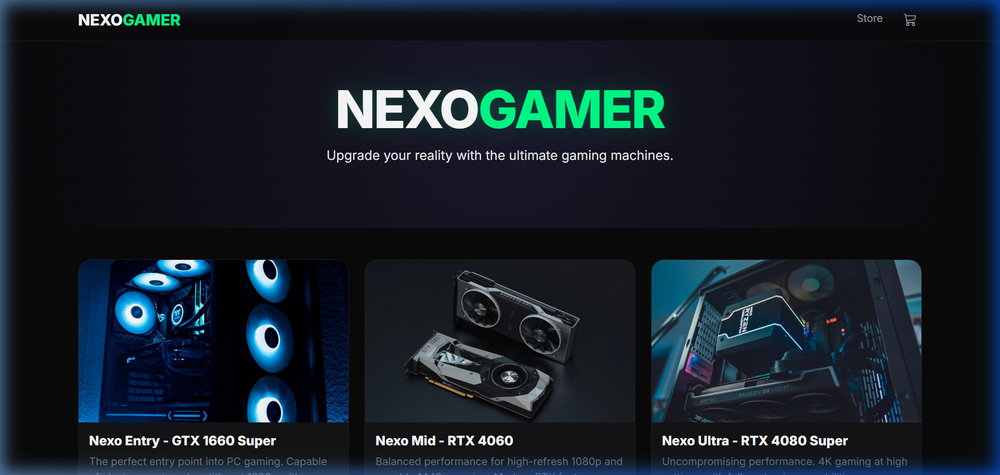

# 🎮 NexoGamer Store - Premium PC Gamer E-Commerce

NexoGamer is a high-end, dark-themed e-commerce platform built with **ASP.NET Core MVC**. It features a modern, responsive design tailored for the gaming community, with glassmorphic elements and neon accents.



## 🚀 Key Features

- **Premium UI/UX**: Dark mode by default with a "Cyberpunk" aesthetic.
- **Dynamic Product Grid**: Responsive layout showcasing high-performance PC builds.
- **Product Details**: Comprehensive technical specifications for every machine.
- **Entry-Level Focus**: Includes specific builds like the GTX 1660 Super for budget gaming.
- **Shopping Flow**: Fully functional shopping cart and checkout process.
- **Glassmorphism**: Modern UI components with blur and transparency effects.

## 🛠️ Built With

- **Backend**: .NET 8.0 (ASP.NET Core MVC)
- **Frontend**: Vanilla CSS / HTML5 / JavaScript
- **Styling**: Bootstrap 5 + Custom Premium CSS
- **Icons**: Bootstrap Icons
- **Fonts**: Google Fonts (Inter)

## 📦 Project Structure

- `Controllers/`: Application logic (Home, Cart).
- `Models/`: Data structures (Product, ErrorViewModel).
- `Views/`: Razor templates for the store pages.
- `wwwroot/`: Static assets (CSS, Images, JS).

## 📥 How to Run

1. **Prerequisites**: Ensure you have [.NET 8.0 SDK](https://dotnet.microsoft.com/download/dotnet/8.0) installed.
2. **Clone the Repo**:
   ```bash
   git clone https://github.com/allan-lavorat-sudo/Project-PC-Gamer-Store-.NET.git
   cd Project-PC-Gamer-Store-.NET
   ```
3. **Run the Project**:
   ```bash
   dotnet run
   ```
4. **Access the Site**: Open `http://localhost:5000` in your browser.

## 📸 Screenshots

### Homepage
- High-quality grid of PC builds.
- Animated hover effects.

### Details Page
- Full specifications: CPU, GPU, RAM, SSD.
- One-click "Add to Cart".

## 📜 License
This project is for demonstration purposes. Images provided by Unsplash.

---
Built with 💚 by Antigravity for Allan.
